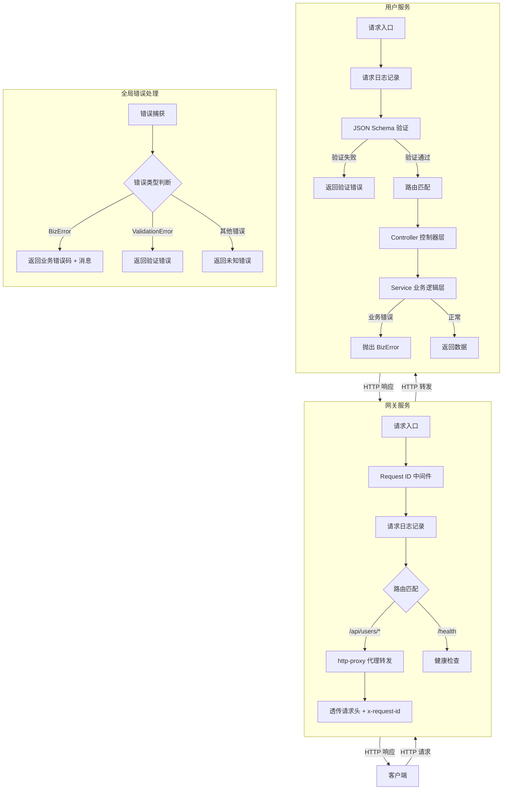
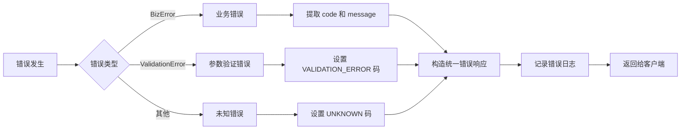

# 用户请求处理完整流程说明

## 一、项目架构概览

这是一个基于 **Fastify** 的 Node.js 微服务架构项目，包含以下核心组件：

| 组件 | 说明 | 端口 |
|------|------|------|
| **API Gateway** | 网关服务，负责请求路由、转发、日志追踪 | 3000 |
| **User Service** | 用户服务，处理用户相关业务逻辑 | 3001 |
| **Shared Package** | 共享包，提供统一类型、错误处理、响应工具、日志等 | - |

### 目录结构

```
Winter/
├── packages/
│   └── shared/              # 共享包
│       └── src/
│           ├── logger/      # 日志工具
│           ├── types/       # 类型定义（API 响应、错误码）
│           └── utils/       # 工具函数（响应、环境变量）
└── services/
    ├── gateway/             # 网关服务
    │   └── src/
    │       ├── middlewares/ # 中间件
    │       └── routes/      # 路由
    └── user-service/        # 用户服务
        └── src/
            ├── controllers/ # 控制器层
            ├── routes/      # 路由层
            ├── schemas/     # 数据验证 Schema
            └── services/    # 业务逻辑层
```

---

## 二、请求处理完整流程

### 2.1 整体流程图



### 2.2 详细步骤说明

#### 第 1 步：请求到达网关

用户请求首先到达 **API 网关**（端口 3000）。

**关键代码**：[index.ts](file:///d:/code/trae/gsb/20260608/node-microserve-代码理解-1/Winter/services/gateway/src/index.ts#L10-L14)

```typescript
const app = Fastify({
  logger: false,
  requestIdHeader: 'x-request-id',
  genReqId: () => crypto.randomUUID(),
})
```

#### 第 2 步：Request ID 中间件

为每个请求生成或复用唯一的请求 ID，便于全链路追踪。

**关键代码**：[request-id.ts](file:///d:/code/trae/gsb/20260608/node-microserve-代码理解-1/Winter/services/gateway/src/middlewares/request-id.ts#L8-L23)

- 如果请求头中已有 `x-request-id`，则复用该 ID
- 否则生成新的 UUID
- 响应头中也会返回 `x-request-id`

#### 第 3 步：请求日志记录

记录请求的基本信息（方法、URL、请求 ID）。

**关键代码**：[index.ts](file:///d:/code/trae/gsb/20260608/node-microserve-代码理解-1/Winter/services/gateway/src/index.ts#L20-L22)

```typescript
app.addHook('onRequest', async (request) => {
  logger.info({ requestId: request.id, method: request.method, url: request.url }, 'Incoming request')
})
```

#### 第 4 步：路由匹配与代理转发

网关根据请求路径决定如何处理：

- `/health`：网关自身的健康检查
- `/api/users/*`：转发到用户服务
- 其他：404

**代理规则**：
- 路径前缀：`/api/users` → `/users`
- 上游服务：`http://user-service:3001`
- 超时：30 秒

**关键代码**：[proxy.ts](file:///d:/code/trae/gsb/20260608/node-microserve-代码理解-1/Winter/services/gateway/src/routes/proxy.ts#L15-L35)

#### 第 5 步：请求头透传

代理转发时会添加/透传以下请求头：

- `x-request-id`：请求追踪 ID
- `x-forwarded-for`：客户端真实 IP

#### 第 6 步：用户服务接收请求

请求到达用户服务（端口 3001），用户服务也会记录请求日志。

**关键代码**：[index.ts](file:///d:/code/trae/gsb/20260608/node-microserve-代码理解-1/Winter/services/user-service/src/index.ts#L15-L20)

#### 第 7 步：JSON Schema 验证

Fastify 会根据路由定义的 Schema 自动验证请求参数（params、query、body）。

**示例 - 创建用户验证**：
- `name`：必填，字符串，长度 1-100
- `email`：必填，字符串，email 格式
- 不允许额外属性

**关键代码**：[user.schema.ts](file:///d:/code/trae/gsb/20260608/node-microserve-代码理解-1/Winter/services/user-service/src/schemas/user.schema.ts#L23-L33)

#### 第 8 步：路由匹配

根据请求方法和路径匹配对应的控制器方法。

| 方法 | 路径 | 控制器 | 说明 |
|------|------|--------|------|
| GET | /users | userController.list | 获取用户列表（分页） |
| GET | /users/:id | userController.getById | 获取单个用户 |
| POST | /users | userController.create | 创建用户 |
| PUT | /users/:id | userController.update | 更新用户 |
| DELETE | /users/:id | userController.delete | 删除用户 |

**关键代码**：[user.routes.ts](file:///d:/code/trae/gsb/20260608/node-microserve-代码理解-1/Winter/services/user-service/src/routes/user.routes.ts#L13-L28)

#### 第 9 步：控制器层（Controller）

控制器负责：
- 解析请求参数
- 调用服务层方法
- 构造响应

**关键代码**：[user.controller.ts](file:///d:/code/trae/gsb/20260608/node-microserve-代码理解-1/Winter/services/user-service/src/controllers/user.controller.ts)

#### 第 10 步：服务层（Service）

服务层处理核心业务逻辑：
- 数据校验（业务规则）
- 数据操作（当前使用内存存储）
- 业务错误抛出

**关键代码**：[user.service.ts](file:///d:/code/trae/gsb/20260608/node-microserve-代码理解-1/Winter/services/user-service/src/services/user.service.ts)

#### 第 11 步：响应返回

服务层返回数据 → 控制器 → 通过 `sendSuccess` 工具函数构造统一响应格式。

**统一响应格式**：
```typescript
interface ApiResponse<T> {
  code: number      // 业务状态码，0 表示成功
  data: T | null    // 响应数据
  message: string   // 响应消息
  requestId?: string // 请求追踪 ID
}
```

**关键代码**：[response.ts](file:///d:/code/trae/gsb/20260608/node-microserve-代码理解-1/Winter/packages/shared/src/utils/response.ts#L7-L20)

#### 第 12 步：响应日志

用户服务和网关都会记录响应日志，包含状态码和响应时间。

#### 第 13 步：响应返回客户端

响应通过网关返回给客户端，响应头中包含 `x-request-id`。

---

## 三、错误处理机制

### 3.1 错误类型

| 错误类型 | 错误码 | HTTP 状态码 | 说明 |
|----------|--------|-------------|------|
| 成功 | 0 | 200 | 请求成功 |
| 未知错误 | 10000 | 500 | 未预期的错误 |
| 资源未找到 | 10001 | 404 | 请求的资源不存在 |
| 验证错误 | 10002 | 400 | 请求参数验证失败 |
| 未授权 | 10003 | 401 | 未登录或 token 无效 |
| 服务不可用 | 10004 | 503 | 服务暂时不可用 |
| 请求超时 | 10005 | 408 | 请求超时 |
| 频率超限 | 10006 | 429 | 请求频率过高 |
| 用户不存在 | 20001 | 404 | 用户 ID 不存在 |
| 用户已存在 | 20002 | 409 | 邮箱已被注册 |
| 密码错误 | 20003 | 400 | 密码错误 |

**关键代码**：[error.ts](file:///d:/code/trae/gsb/20260608/node-microserve-代码理解-1/Winter/packages/shared/src/types/error.ts)

### 3.2 错误处理流程



### 3.3 业务错误（BizError）

业务层通过抛出 `BizError` 来传递业务错误信息。

**使用示例**：
```typescript
if (!user) {
  throw new BizError(ErrorCode.USER_NOT_FOUND, `User with id ${id} not found`, 404)
}
```

**便捷方法**：
- `BizError.notFound(message)` - 404 错误
- `BizError.validation(message)` - 400 验证错误
- `BizError.unauthorized(message)` - 401 未授权
- `BizError.serviceUnavailable(message)` - 503 服务不可用

**关键代码**：[error.ts](file:///d:/code/trae/gsb/20260608/node-microserve-代码理解-1/Winter/packages/shared/src/types/error.ts#L32-L61)

### 3.4 全局错误处理器

每个服务都有全局错误处理器，统一处理所有异常。

**用户服务错误处理逻辑**：
1. 如果是 `BizError`，返回对应的业务错误码和消息
2. 如果是 Fastify 验证错误（`error.validation`），返回验证错误
3. 其他错误统一返回未知错误（500）

**关键代码**：[index.ts](file:///d:/code/trae/gsb/20260608/node-microserve-代码理解-1/Winter/services/user-service/src/index.ts#L37-L73)

### 3.5 错误响应格式

所有错误都使用统一的响应格式：

```json
{
  "code": 20001,
  "data": null,
  "message": "User with id 999 not found",
  "requestId": "550e8400-e29b-41d4-a716-446655440000"
}
```

---

## 四、关键设计模式

### 4.1 统一响应格式

所有 API 响应都遵循 `ApiResponse` 结构，便于客户端统一处理。

**优点**：
- 响应结构一致，易于解析
- 包含请求 ID，便于问题排查
- 业务状态码与 HTTP 状态码分离

### 4.2 全链路追踪

通过 `x-request-id` 请求头实现全链路日志追踪：
- 网关生成或接收请求 ID
- 代理转发时透传请求 ID
- 所有日志都包含请求 ID
- 响应头返回请求 ID

### 4.3 分层架构

用户服务采用经典的三层架构：
- **Routes 层**：路由定义和 Schema 验证
- **Controller 层**：请求处理和响应构造
- **Service 层**：业务逻辑和数据操作

### 4.4 共享包复用

通过 `@scaffold/shared` 包共享：
- 类型定义
- 错误处理
- 响应工具
- 日志工具
- 环境变量工具

---

## 五、代码参考索引

| 模块 | 文件路径 | 说明 |
|------|----------|------|
| API 响应类型 | [api.ts](file:///d:/code/trae/gsb/20260608/node-microserve-代码理解-1/Winter/packages/shared/src/types/api.ts) | 统一响应结构定义 |
| 错误码定义 | [error.ts](file:///d:/code/trae/gsb/20260608/node-microserve-代码理解-1/Winter/packages/shared/src/types/error.ts) | BizError 类和错误码枚举 |
| 响应工具 | [response.ts](file:///d:/code/trae/gsb/20260608/node-microserve-代码理解-1/Winter/packages/shared/src/utils/response.ts) | sendSuccess/sendError 等 |
| 日志工具 | [index.ts](file:///d:/code/trae/gsb/20260608/node-microserve-代码理解-1/Winter/packages/shared/src/logger/index.ts) | Pino 日志封装 |
| 网关入口 | [index.ts](file:///d:/code/trae/gsb/20260608/node-microserve-代码理解-1/Winter/services/gateway/src/index.ts) | 网关服务主文件 |
| 网关代理 | [proxy.ts](file:///d:/code/trae/gsb/20260608/node-microserve-代码理解-1/Winter/services/gateway/src/routes/proxy.ts) | 代理路由配置 |
| 请求 ID 中间件 | [request-id.ts](file:///d:/code/trae/gsb/20260608/node-microserve-代码理解-1/Winter/services/gateway/src/middlewares/request-id.ts) | 请求 ID 处理 |
| 用户服务入口 | [index.ts](file:///d:/code/trae/gsb/20260608/node-microserve-代码理解-1/Winter/services/user-service/src/index.ts) | 用户服务主文件 |
| 用户路由 | [user.routes.ts](file:///d:/code/trae/gsb/20260608/node-microserve-代码理解-1/Winter/services/user-service/src/routes/user.routes.ts) | 用户路由定义 |
| 用户控制器 | [user.controller.ts](file:///d:/code/trae/gsb/20260608/node-microserve-代码理解-1/Winter/services/user-service/src/controllers/user.controller.ts) | 用户控制器 |
| 用户服务层 | [user.service.ts](file:///d:/code/trae/gsb/20260608/node-microserve-代码理解-1/Winter/services/user-service/src/services/user.service.ts) | 用户业务逻辑 |
| 用户 Schema | [user.schema.ts](file:///d:/code/trae/gsb/20260608/node-microserve-代码理解-1/Winter/services/user-service/src/schemas/user.schema.ts) | 数据验证 Schema |
