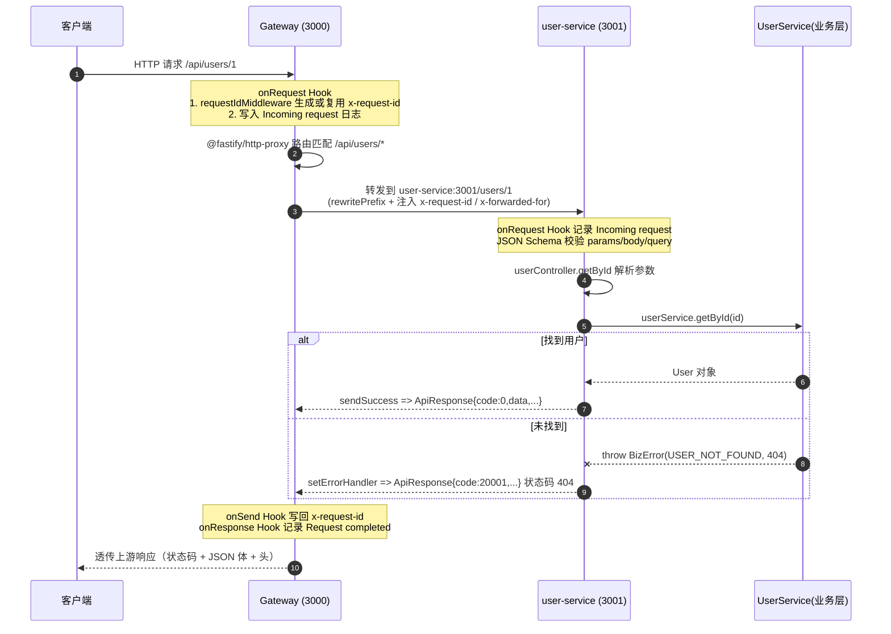
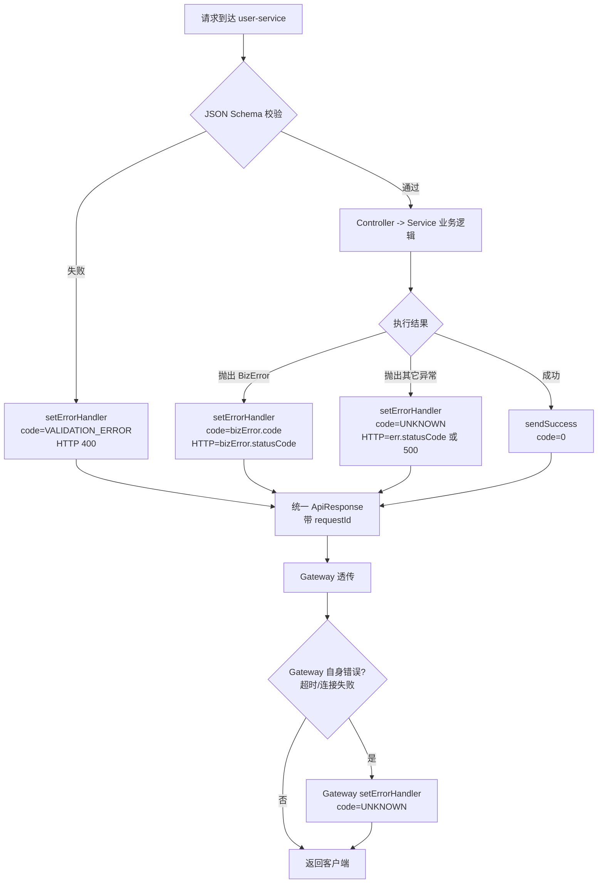

# 用户请求完整链路分析

本文档梳理一次用户请求（以 `GET /api/users/:id` 为例）从客户端进入系统、在 `gateway` 与 `user-service` 之间流转、最终返回响应的完整过程，并说明各环节的错误处理机制。

---

## 一、系统架构概览

项目基于 monorepo 组织，使用 Fastify + TypeScript 构建，包含两个微服务和一个公共包：

- **gateway**（端口 3000）：API 网关，负责接收外部请求并转发到下游服务。
  - 入口：[index.ts](file:///d:/code/trae/gsb/20260608/node-microserve-%E4%BB%A3%E7%A0%81%E7%90%86%E8%A7%A3-1/Summer/services/gateway/src/index.ts)
  - 代理路由：[proxy.ts](file:///d:/code/trae/gsb/20260608/node-microserve-%E4%BB%A3%E7%A0%81%E7%90%86%E8%A7%A3-1/Summer/services/gateway/src/routes/proxy.ts)
  - 请求 ID 中间件：[request-id.ts](file:///d:/code/trae/gsb/20260608/node-microserve-%E4%BB%A3%E7%A0%81%E7%90%86%E8%A7%A3-1/Summer/services/gateway/src/middlewares/request-id.ts)
- **user-service**（端口 3001）：用户域微服务，承担用户增删改查业务。
  - 入口：[index.ts](file:///d:/code/trae/gsb/20260608/node-microserve-%E4%BB%A3%E7%A0%81%E7%90%86%E8%A7%A3-1/Summer/services/user-service/src/index.ts)
  - 路由：[user.routes.ts](file:///d:/code/trae/gsb/20260608/node-microserve-%E4%BB%A3%E7%A0%81%E7%90%86%E8%A7%A3-1/Summer/services/user-service/src/routes/user.routes.ts)
  - 控制器：[user.controller.ts](file:///d:/code/trae/gsb/20260608/node-microserve-%E4%BB%A3%E7%A0%81%E7%90%86%E8%A7%A3-1/Summer/services/user-service/src/controllers/user.controller.ts)
  - 业务层：[user.service.ts](file:///d:/code/trae/gsb/20260608/node-microserve-%E4%BB%A3%E7%A0%81%E7%90%86%E8%A7%A3-1/Summer/services/user-service/src/services/user.service.ts)
  - 校验 Schema：[user.schema.ts](file:///d:/code/trae/gsb/20260608/node-microserve-%E4%BB%A3%E7%A0%81%E7%90%86%E8%A7%A3-1/Summer/services/user-service/src/schemas/user.schema.ts)
- **@scaffold/shared**：跨服务复用的工具集（日志、统一响应、错误类型、环境读取）。
  - 错误体系：[error.ts](file:///d:/code/trae/gsb/20260608/node-microserve-%E4%BB%A3%E7%A0%81%E7%90%86%E8%A7%A3-1/Summer/packages/shared/src/types/error.ts)
  - 响应工具：[response.ts](file:///d:/code/trae/gsb/20260608/node-microserve-%E4%BB%A3%E7%A0%81%E7%90%86%E8%A7%A3-1/Summer/packages/shared/src/utils/response.ts)
  - 统一响应结构：[api.ts](file:///d:/code/trae/gsb/20260608/node-microserve-%E4%BB%A3%E7%A0%81%E7%90%86%E8%A7%A3-1/Summer/packages/shared/src/types/api.ts)
  - 日志工厂：[logger/index.ts](file:///d:/code/trae/gsb/20260608/node-microserve-%E4%BB%A3%E7%A0%81%E7%90%86%E8%A7%A3-1/Summer/packages/shared/src/logger/index.ts)

---

## 二、整体调用流程图



---

## 三、详细执行步骤

### 1. 请求进入 Gateway

Fastify 实例在 [services/gateway/src/index.ts](file:///d:/code/trae/gsb/20260608/node-microserve-%E4%BB%A3%E7%A0%81%E7%90%86%E8%A7%A3-1/Summer/services/gateway/src/index.ts#L10-L14) 创建时配置了 `requestIdHeader: 'x-request-id'` 与 `genReqId`，随后注册了请求 ID 中间件、请求/响应日志钩子、全局错误处理器与代理路由。

`onRequest` 阶段执行的关键工作：
- [requestIdMiddleware](file:///d:/code/trae/gsb/20260608/node-microserve-%E4%BB%A3%E7%A0%81%E7%90%86%E8%A7%A3-1/Summer/services/gateway/src/middlewares/request-id.ts#L8-L22)：若客户端已带 `x-request-id` 则复用，否则用 `crypto.randomUUID()` 生成；同时通过 `onSend` 把该 ID 回写响应头，便于全链路日志关联。
- 全局 `onRequest` 钩子写入 `Incoming request` 日志，附带 `requestId / method / url`。

### 2. 网关代理转发

`/api/users/*` 由 [registerProxyRoutes](file:///d:/code/trae/gsb/20260608/node-microserve-%E4%BB%A3%E7%A0%81%E7%90%86%E8%A7%A3-1/Summer/services/gateway/src/routes/proxy.ts#L8-L35) 借助 `@fastify/http-proxy` 转发到 `config.upstream.userService`（默认 `http://user-service:3001`）。
- `prefix` + `rewritePrefix` 把 `/api/users/1` 改写为 `/users/1`。
- `rewriteRequestHeaders` 注入 `x-request-id` 与 `x-forwarded-for`，把网关上下文带到下游。
- 通过 [config.requestTimeout](file:///d:/code/trae/gsb/20260608/node-microserve-%E4%BB%A3%E7%A0%81%E7%90%86%E8%A7%A3-1/Summer/services/gateway/src/config.ts#L20)（默认 30 秒）限制对上游的等待时间，防止挂死。

此外网关内置了 `/health` 与 `/` 两个本地端点，不会进入代理逻辑。

### 3. user-service 接收与校验

[services/user-service/src/index.ts](file:///d:/code/trae/gsb/20260608/node-microserve-%E4%BB%A3%E7%A0%81%E7%90%86%E8%A7%A3-1/Summer/services/user-service/src/index.ts#L9-L34) 同样使用 `requestIdHeader: 'x-request-id'`，因此能复用网关传过来的 `requestId` 写入日志，实现跨服务日志关联。

[user.routes.ts](file:///d:/code/trae/gsb/20260608/node-microserve-%E4%BB%A3%E7%A0%81%E7%90%86%E8%A7%A3-1/Summer/services/user-service/src/routes/user.routes.ts) 注册了 5 条用户路由，每条路由都绑定了 [user.schema.ts](file:///d:/code/trae/gsb/20260608/node-microserve-%E4%BB%A3%E7%A0%81%E7%90%86%E8%A7%A3-1/Summer/services/user-service/src/schemas/user.schema.ts) 中的 JSON Schema：Fastify 会先做 `params / body / querystring` 校验，校验失败直接进入错误处理器（参见第四节）。

### 4. 控制器与业务层

控制器只负责参数解析和调用业务层，[user.controller.ts](file:///d:/code/trae/gsb/20260608/node-microserve-%E4%BB%A3%E7%A0%81%E7%90%86%E8%A7%A3-1/Summer/services/user-service/src/controllers/user.controller.ts) 用共享的 `sendSuccess` 输出统一响应：

```ts
return sendSuccess(reply, user)
```

业务层 [user.service.ts](file:///d:/code/trae/gsb/20260608/node-microserve-%E4%BB%A3%E7%A0%81%E7%90%86%E8%A7%A3-1/Summer/services/user-service/src/services/user.service.ts) 实现 CRUD（演示用内存 `Map` 存储），遇到业务异常直接抛 `BizError`，例如：

- `getById` 找不到用户 → `BizError(ErrorCode.USER_NOT_FOUND, ..., 404)`
- `create / update` 邮箱冲突 → `BizError(ErrorCode.USER_ALREADY_EXISTS, ..., 409)`
- `delete` 找不到用户 → `BizError(ErrorCode.USER_NOT_FOUND, ..., 404)`

### 5. 统一响应结构

所有成功 / 失败响应都遵循 [ApiResponse](file:///d:/code/trae/gsb/20260608/node-microserve-%E4%BB%A3%E7%A0%81%E7%90%86%E8%A7%A3-1/Summer/packages/shared/src/types/api.ts#L4-L13)：

```json
{
  "code": 0,
  "data": { "...": "..." },
  "message": "success",
  "requestId": "uuid"
}
```

`sendSuccess` / `sendError` / `sendPaginated` 均位于 [response.ts](file:///d:/code/trae/gsb/20260608/node-microserve-%E4%BB%A3%E7%A0%81%E7%90%86%E8%A7%A3-1/Summer/packages/shared/src/utils/response.ts)，统一注入 `requestId`、`code`、`message`。

### 6. 响应回流

- user-service 的 `onResponse` 钩子记录 `statusCode / responseTime`。
- gateway 的 `onSend` 把 `x-request-id` 写回响应头，`onResponse` 写 `Request completed` 日志。
- 客户端最终得到带 `x-request-id` 的统一 JSON 响应。

---

## 四、错误处理体系

错误处理分散在四层，最终都收敛到统一响应结构。

### 4.1 业务层抛出 `BizError`

[BizError](file:///d:/code/trae/gsb/20260608/node-microserve-%E4%BB%A3%E7%A0%81%E7%90%86%E8%A7%A3-1/Summer/packages/shared/src/types/error.ts#L32-L61) 同时携带：
- `code`：业务错误码（[ErrorCode](file:///d:/code/trae/gsb/20260608/node-microserve-%E4%BB%A3%E7%A0%81%E7%90%86%E8%A7%A3-1/Summer/packages/shared/src/types/error.ts#L2-L29) 枚举）。
- `statusCode`：HTTP 状态码。
- 静态工厂：`notFound / validation / unauthorized / serviceUnavailable`。

### 4.2 user-service 全局错误处理器

[setErrorHandler](file:///d:/code/trae/gsb/20260608/node-microserve-%E4%BB%A3%E7%A0%81%E7%90%86%E8%A7%A3-1/Summer/services/user-service/src/index.ts#L37-L73) 按以下优先级处理错误：

1. **`error.name === 'BizError'`**：使用 `bizError.code`、`bizError.statusCode` 输出；保留业务语义。
2. **`error.validation`（Fastify Schema 校验失败）**：返回 `code: VALIDATION_ERROR`、HTTP 400。
3. **其它错误**：fallback 为 `code: UNKNOWN`、HTTP `error.statusCode || 500`。
4. 任何分支都会先 `logger.error` 输出 `requestId / message / stack`，便于排障。

### 4.3 gateway 全局错误处理器

[gateway 的 setErrorHandler](file:///d:/code/trae/gsb/20260608/node-microserve-%E4%BB%A3%E7%A0%81%E7%90%86%E8%A7%A3-1/Summer/services/gateway/src/index.ts#L39-L51) 主要兜底网关自身错误（如代理失败、上游超时、上游不可达），输出 `code: UNKNOWN` + 原始 `statusCode`。当下游能正常返回时，`@fastify/http-proxy` 透传上游状态码与响应体（包含真实业务错误码），网关不会改写。

### 4.4 进程级保护

两个服务都注册了 SIGTERM / SIGINT 监听并执行 `app.close()` 优雅关闭；启动失败、shutdown 失败均通过 `logger.error` + `process.exit(1)` 暴露。

---

## 五、错误处理流程图



---

## 六、可观测性与请求追踪

- **requestId 串联**：客户端 → gateway（`requestIdMiddleware` 生成/复用）→ 通过 `rewriteRequestHeaders` 注入到下游 → user-service 直接复用 → 错误日志和响应体（`ApiResponse.requestId`）都附带相同 ID。
- **日志格式**：[createLogger](file:///d:/code/trae/gsb/20260608/node-microserve-%E4%BB%A3%E7%A0%81%E7%90%86%E8%A7%A3-1/Summer/packages/shared/src/logger/index.ts#L15-L44) 在开发环境使用 `pino-pretty`，生产环境输出 JSON，方便接入日志聚合。
- **响应头透传**：gateway 在 `onSend` 阶段写回 `x-request-id`，客户端可据此向后端关联问题。

---

## 七、典型时序示例

以 `GET /api/users/999`（用户不存在）为例：

1. 客户端发起请求，无 `x-request-id` 头。
2. gateway `onRequest` 生成 `requestId=abc-123`，写入日志。
3. `@fastify/http-proxy` 转发到 `http://user-service:3001/users/999`，注入 `x-request-id: abc-123`。
4. user-service `onRequest` 复用同一 `requestId` 记录日志；JSON Schema 校验通过。
5. `userController.getById` 调 `userService.getById(999)`，业务层 `Map.get` 返回空 → 抛 `BizError(USER_NOT_FOUND, 404)`。
6. user-service 的 `setErrorHandler` 命中 `BizError` 分支，返回：
   ```json
   { "code": 20001, "data": null, "message": "User with id 999 not found", "requestId": "abc-123" }
   ```
   HTTP 状态码 404。
7. gateway 透传上游响应；`onSend` 写回 `x-request-id: abc-123`，`onResponse` 记录耗时。
8. 客户端收到带 `x-request-id` 的 404 响应，可据此到日志系统检索完整链路。

